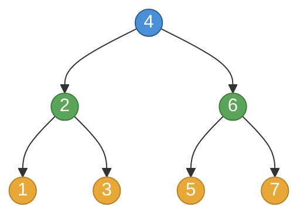
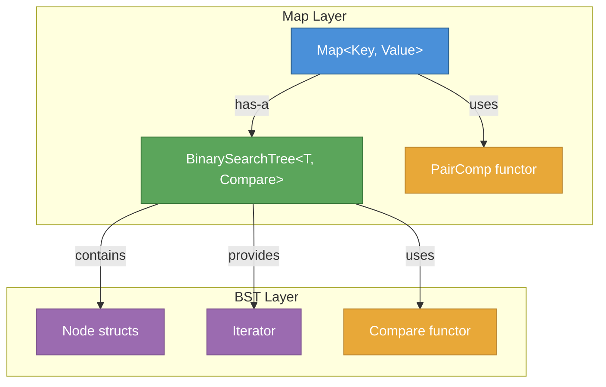

# 🌳 Binary Search Tree & Map

**EECS 280 Project 6** · University of Michigan · Winter 2026

> A templated Binary Search Tree and Map implementation in C++, featuring recursive algorithms, custom comparators, and iterator support.

---

## Project Structure

```
p6-bst-map/
├── BinarySearchTree.hpp          ← Core BST implementation (recursive)
├── BinarySearchTree_tests.cpp    ← Unit tests for BST
├── Map.hpp                       ← Map ADT built on top of BST
├── Map_tests.cpp                 ← Unit tests for Map
├── TreePrint.hpp                 ← Pretty-printing helper
├── unit_test_framework.hpp       ← Testing framework
└── Makefile                      ← Build commands
```

---

## How BST Works

A **Binary Search Tree** maintains a sorted structure: every node's left subtree contains smaller elements, and every node's right subtree contains larger elements.

### Insertion Example

Inserting `4, 2, 6, 1, 3, 5, 7` in order builds this tree:



### Traversals

| Traversal | Order | Result |
|-----------|-------|--------|
| **In-order** | Left → Root → Right | `1 2 3 4 5 6 7` |
| **Pre-order** | Root → Left → Right | `4 2 1 3 6 5 7` |

### Sorting Invariant

Every node must satisfy:

```mermaid
graph LR
    subgraph Valid ✅
        direction TB
        A1((4)) --> B1((2))
        A1 --> C1((6))
    end

    subgraph Invalid ❌
        direction TB
        A2((2)) --> B2((3))
        A2 --> C2((7))
    end

    style A1 fill:#5BA55B,stroke:#3D7A3D,color:#fff
    style B1 fill:#5BA55B,stroke:#3D7A3D,color:#fff
    style C1 fill:#5BA55B,stroke:#3D7A3D,color:#fff
    style A2 fill:#D94A4A,stroke:#A33636,color:#fff
    style B2 fill:#D94A4A,stroke:#A33636,color:#fff
    style C2 fill:#D94A4A,stroke:#A33636,color:#fff
```

---

## Architecture Overview



**Map** stores `std::pair<Key, Value>` in a BST, using a custom `PairComp` functor that compares only by key.

---

## Key Recursive Functions

| Function | Type | Strategy |
|----------|------|----------|
| `empty_impl` | O(1) | `node == nullptr` |
| `size_impl` | Tree recursive | `1 + left + right` |
| `height_impl` | Tree recursive | `1 + max(left, right)` |
| `insert_impl` | Linear recursive | Compare → go left/right → assign back |
| `find_impl` | Tail recursive | Binary search: left / right / found |
| `min_element_impl` | Tail recursive | Keep going left |
| `max_element_impl` | Tail recursive | Keep going right |
| `min_greater_than_impl` | Linear recursive | Track best candidate going left |
| `check_sorting_invariant_impl` | Tree recursive | Check max(left) < node < min(right) |

---

## Build & Test

```bash
# Compile and run all tests
make test

# Run individual test suites
make BinarySearchTree_tests.exe && ./BinarySearchTree_tests.exe
make BinarySearchTree_public_tests.exe && ./BinarySearchTree_public_tests.exe
make Map_public_tests.exe && ./Map_public_tests.exe

# Compile check
make BinarySearchTree_compile_check.exe
make Map_compile_check.exe

# Run with address sanitizer (detect memory errors)
make BinarySearchTree_tests.exe CXXFLAGS="-fsanitize=address -g"
./BinarySearchTree_tests.exe
```

---

## Map Usage Example

```cpp
Map<string, double> words;
words["hello"] = 1.0;
words["world"] = 2.0;
words.insert({"pi", 3.14159});

for (const auto &kv : words) {
    cout << kv.first << " = " << kv.second << endl;
}
// Output (sorted by key):
// hello = 1
// pi = 3.14159
// world = 2

auto it = words.find("pi");
if (it != words.end()) {
    cout << it->second << endl;  // 3.14159
}
```

---

## Technical Details

- **No duplicates** allowed in BST
- **No loops** — all `_impl` functions use recursion
- **Custom comparators** supported via template parameter
- **Iterator** supports in-order traversal (ascending order)
- **Big Three** handled: copy ctor, assignment op, destructor

---

*Built for EECS 280 at the University of Michigan*
